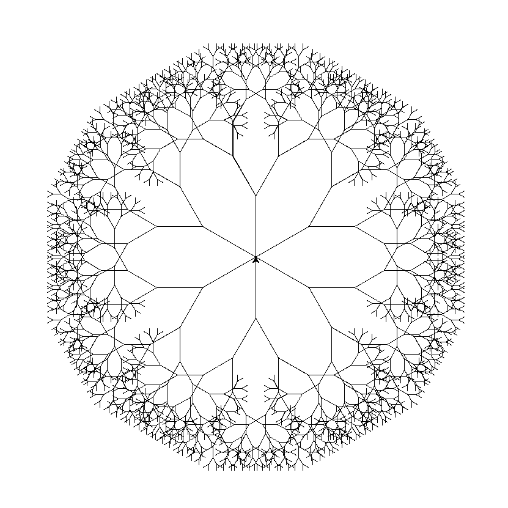
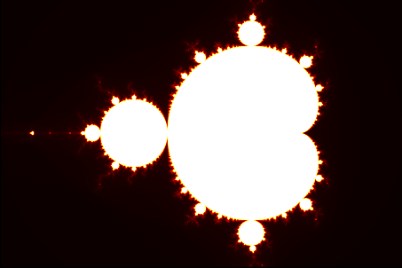

# Makeing Fractals with Python

I have made python codes that makes a normal fractal with turtle and a code that makes mandlebrot set fractal. I will keep adding more. Hope you like it.

## Fractal

</img>

## Mandlebrot set Fractal

</img>